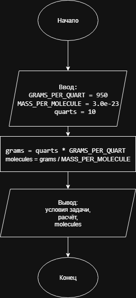

# Домашнее задание к работе 2

## Условие задачи
Масса одной молекулы воды составляет примерно **3.0 × 10⁻²³ грамма**.  
Один кварт воды имеет массу примерно **950 граммов**.  

Напишите программу, которая запрашивает количество воды в квартах и выводит количество молекул воды в этом объёме.

---

## 1. Алгоритм и блок-схема

### Алгоритм
1. **Начало**
2. Объявить константы:
   - `MASS_PER_MOLECULE = 3.0e-23` — масса одной молекулы воды (г).
   - `GRAMS_PER_QUART = 950.0` — масса одного кварта воды (г).
3. Задать исходные данные:
   - `quarts = 10` — количество воды в квартах.
4. Перевести объём в массу:
   - `grams = Q * GRAMS_PER_QUART`
5. Вычислить количество молекул:
   - `molecules = grams / MASS_PER_MOLECULE`
6. Вывести результаты вычислений.
7. **Конец**

### Блок-схема
 

---

## 2. Реализация программы

```c
#include <stdio.h>
#include <locale.h>

#define MASS_PER_MOLECULE 3.0e-23 
#define GRAMS_PER_QUART   950.0 

int main() {
    double quarts = 10;
    double grams;
    double molecules;

    grams = quarts * GRAMS_PER_QUART;
    molecules = grams / MASS_PER_MOLECULE;

    setlocale(LC_ALL, "RUS");

    printf("РАСЧЕТ КОЛИЧЕСТВА МОЛЕКУЛ ВОДЫ\n");
    printf("================================\n\n");

    printf("\nУСЛОВИЯ:\n");
    printf("- Масса 1 молекулы воды: %.1e г\n", MASS_PER_MOLECULE);
    printf("- Масса 1 кварта воды: %.1f г\n", GRAMS_PER_QUART);
    printf("- Кол-во квартов: %.2f кварта(ов)\n", quarts);
    printf("- Общая масса воды: %.2f г\n\n", grams);

    printf("РАСЧЕТ:\n");
    printf("- Количество молекул = масса воды / масса молекулы\n");
    printf("- %.2f г / %.1e г = %.3e молекул\n", grams, MASS_PER_MOLECULE, molecules);
    printf("================================\n");
    printf("ИТОГО: в %.2f кварт(ах) воды содержится приблизительно %.3e молекул.\n", quarts, molecules);

    return 0;
}
```
# 3. Результаты работы программы
РАСЧЕТ КОЛИЧЕСТВА МОЛЕКУЛ ВОДЫ
================================


УСЛОВИЯ:
- Масса 1 молекулы воды: 3,0e-23 г
- Масса 1 кварта воды: 950,0 г
- Кол-во квартов: 10,00 кварта(ов)
- Общая масса воды: 9500,00 г

РАСЧЕТ:
- Количество молекул = масса воды / масса молекулы
- 9500,00 г / 3,0e-23 г = 3,167e+26 молекул
================================
ИТОГО: в 10,00 кварт(ах) воды содержится приблизительно 3,167e+26 молекул.

H:\source\Task2\x64\Debug\Task2.exe (процесс 24964) завершил работу с кодом 0 (0x0).

